# HALAJ-SCHEMA v1.0 - Diagrams

## Entity Relationship Diagram (Full)

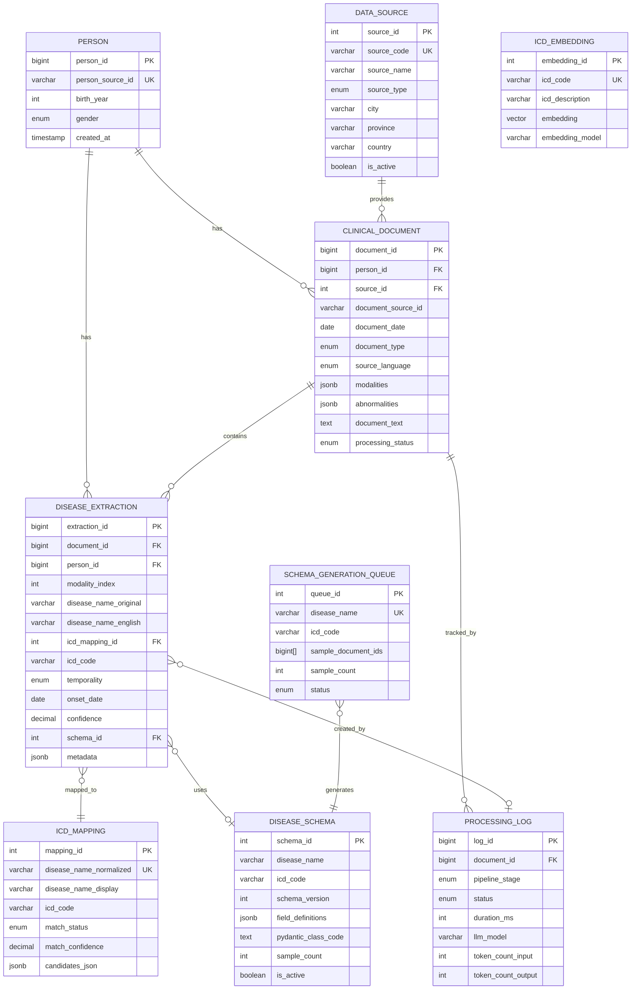

---

## Document Type Flow

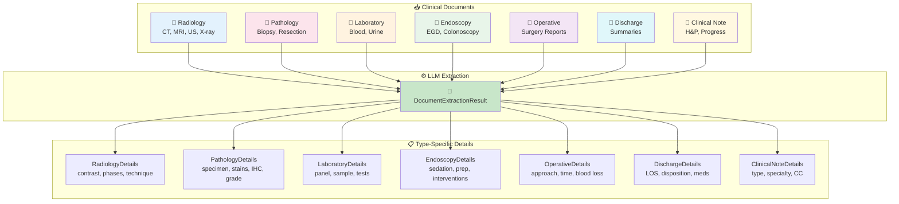

---

## Layer Architecture

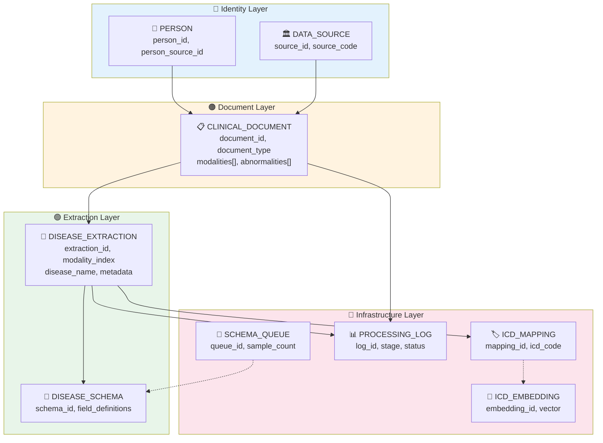

---

## Modality Details by Document Type

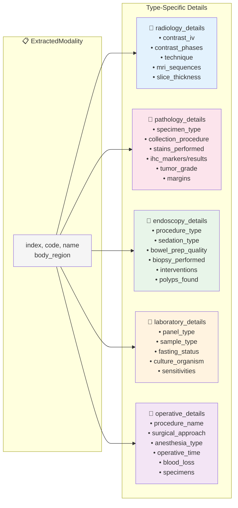

---

## Pipeline Flow

```mermaid
flowchart TD
    subgraph Stage1["📥 Stage 1: Document Ingestion"]
        A[/"📄 Receive Document"/] --> B["Determine document_type"]
        B --> C["👤 Create/Lookup PERSON"]
        C --> D["📋 Create CLINICAL_DOCUMENT"]
        D --> E["📊 Create PROCESSING_LOG"]
        E --> F["🤖 LLM Extraction<br/>DocumentExtractionResult"]
        F --> G["💾 Store modalities[]<br/>with type-specific details"]
        G --> H["💾 Store abnormalities[]"]
        H --> I["🦠 Create DISEASE_EXTRACTION<br/>for each disease"]
    end

    subgraph Stage2["🏷️ Stage 2: ICD Mapping"]
        I --> J["🔤 Normalize disease_name"]
        J --> K{"🔍 ICD_MAPPING<br/>cache lookup"}
        K -->|"✅ Found"| L["♻️ Use existing mapping"]
        K -->|"❌ Not Found"| M["🧮 Vector search<br/>ICD_EMBEDDING"]
        M --> N["🤖 LLM selects<br/>best match"]
        N --> O["💾 Create ICD_MAPPING"]
        O --> L
        L --> P["🔄 Update extraction"]
    end

    subgraph Stage3["📐 Stage 3: Metadata"]
        P --> Q{"📐 Schema<br/>exists?"}
        Q -->|"✅ Yes"| R["🤖 Extract metadata"]
        Q -->|"❌ No"| S["📝 Add to queue"]
        S --> T["⏭️ Skip metadata"]
        R --> U["💾 Update metadata"]
        T --> U
    end

    subgraph Stage4["🔄 Stage 4: Schema Gen"]
        V["⏰ Background"] --> W{"samples >= N?"}
        W -->|"✅ Yes"| X["📄 Fetch samples"]
        X --> Y["🎯 Cluster"]
        Y --> Z["🤖 Generate schema"]
        Z --> AA["💾 Create SCHEMA"]
    end

    U -.-> V

    style F fill:#c8e6c9
    style N fill:#c8e6c9
    style R fill:#c8e6c9
    style Z fill:#c8e6c9
```

---

## Modality Index Linkage

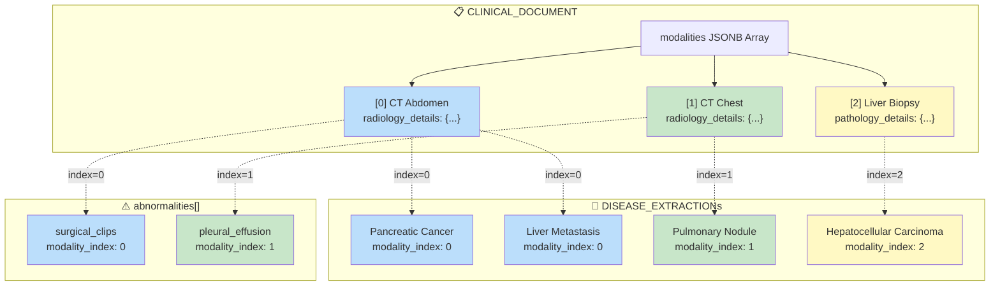

---

## Temporality Classification

```mermaid
graph LR
    subgraph Time["⏱️ Temporality Values"]
        CURRENT["🟢 CURRENT<br/>Active now"]
        HISTORICAL["🔵 HISTORICAL<br/>Past diagnosis"]
        SUSPECTED["🟡 SUSPECTED<br/>Under investigation"]
        RULED_OUT["⚪ RULED_OUT<br/>Excluded"]
        FAMILY["👨‍👩‍👧 FAMILY_HISTORY<br/>In family"]
        CHRONIC["🔄 CHRONIC<br/>Long-term"]
        ACUTE["⚡ ACUTE<br/>Sudden onset"]
        RECURRENT["🔁 RECURRENT<br/>Returned"]
        POST_TX["💊 POST_TREATMENT<br/>After therapy"]
        INCIDENTAL["🔍 INCIDENTAL<br/>Unexpected"]
        UNKNOWN["❓ UNKNOWN<br/>Cannot determine"]
    end

    style CURRENT fill:#c8e6c9
    style HISTORICAL fill:#bbdefb
    style SUSPECTED fill:#fff9c4
    style RULED_OUT fill:#f5f5f5
    style FAMILY fill:#e1bee7
    style CHRONIC fill:#b3e5fc
    style ACUTE fill:#ffcdd2
    style RECURRENT fill:#ffe0b2
    style POST_TX fill:#d1c4e9
    style INCIDENTAL fill:#b2dfdb
    style UNKNOWN fill:#e0e0e0
```

---

## ICD Mapping Workflow

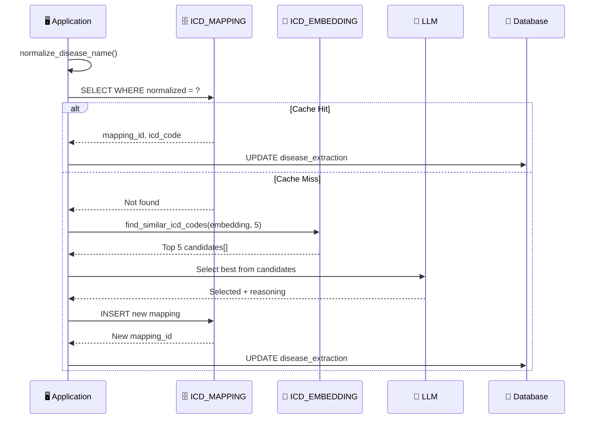

---

## Data Flow

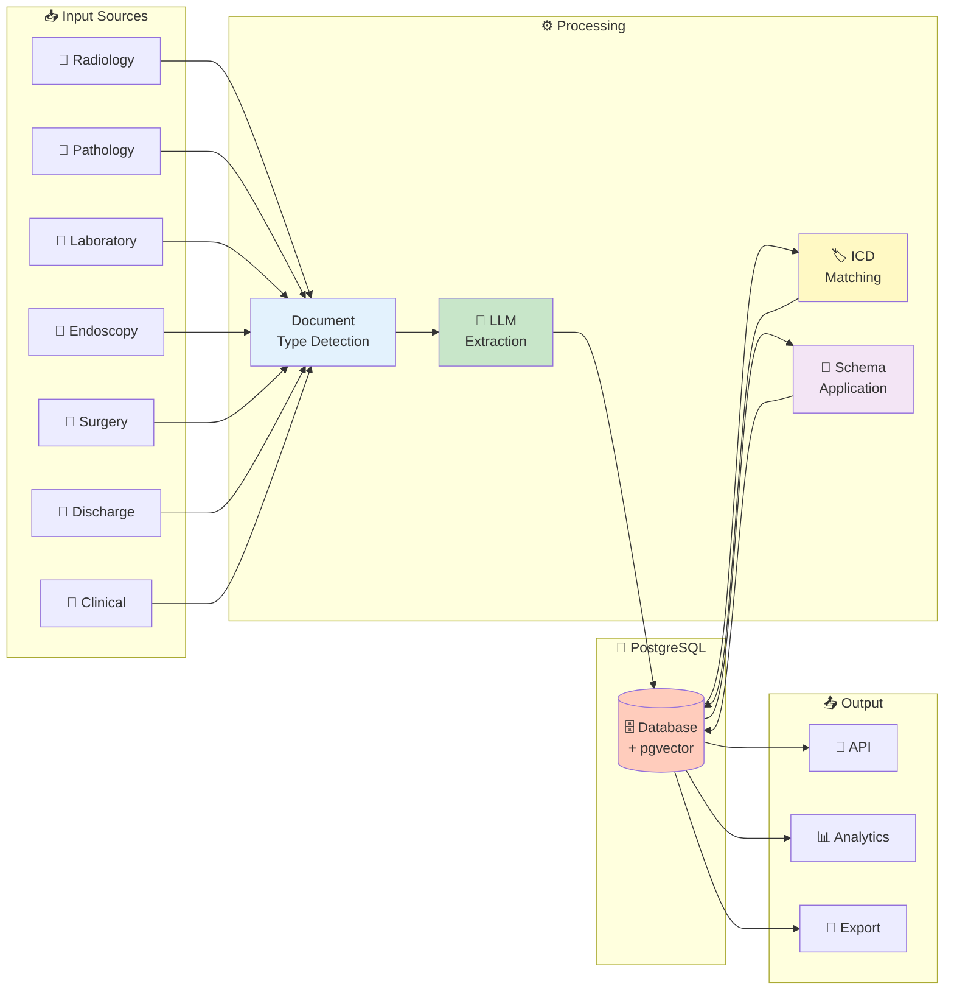

---

## Severity Classification

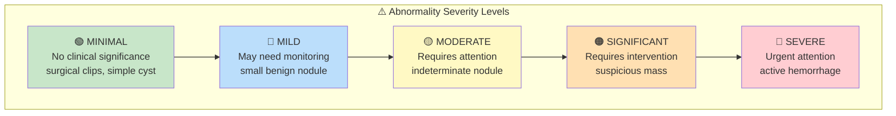

---

## Processing Status Flow

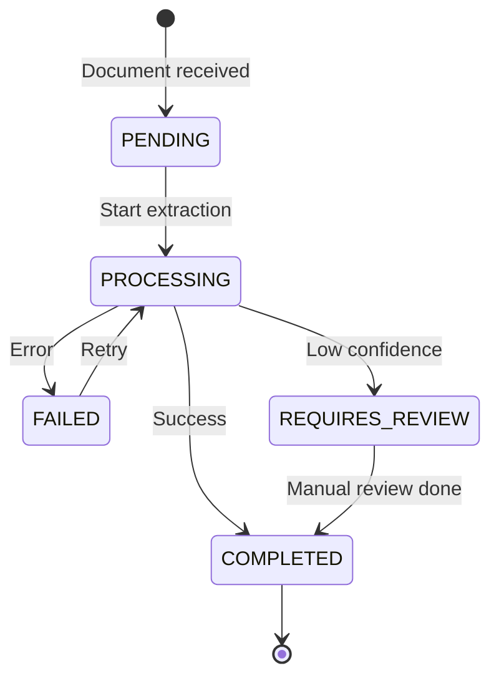

---

## Pydantic Model Hierarchy

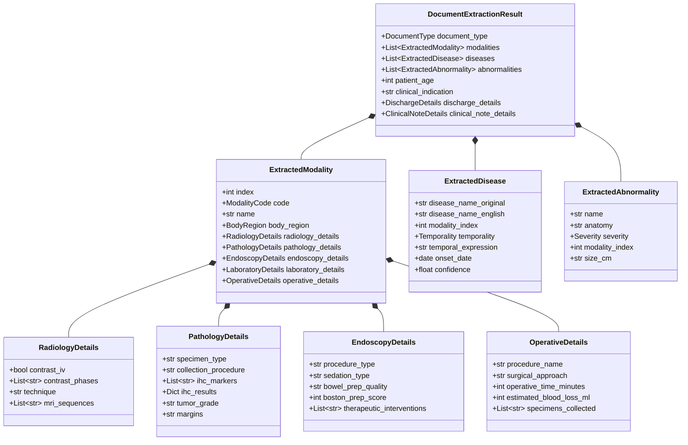
