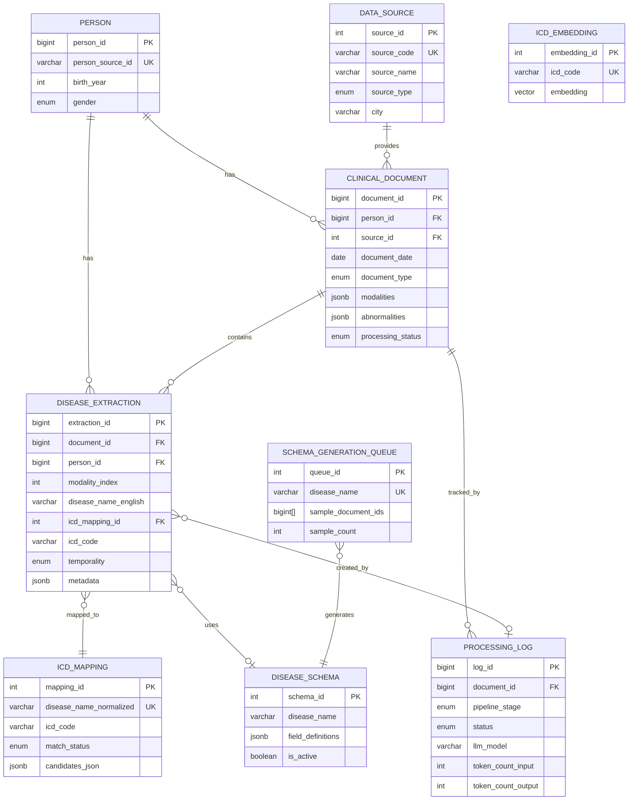
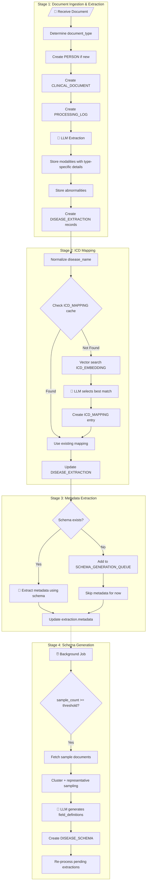

# HALAJ-SCHEMA v1.0

> **Optimized OMOP Schema for NLP-Based Medical Text Extraction**  
> Version 1.0 | December 2025

[](https://www.postgresql.org/)
[](https://github.com/pgvector/pgvector)
[](https://www.python.org/)
[](https://docs.pydantic.dev/)

---

## Table of Contents

- [Overview](#overview)
- [Supported Document Types](#supported-document-types)
- [Architecture](#architecture)
- [Entity Relationship Diagram](#entity-relationship-diagram)
- [Table Definitions](#table-definitions)
- [Type-Specific Metadata](#type-specific-metadata)
- [Enumerations](#enumerations)
- [Pipeline Workflow](#pipeline-workflow)
- [Query Patterns](#query-patterns)
- [Implementation Guide](#implementation-guide)
- [Files](#files)

---

## Overview

HALAJ-SCHEMA is a streamlined data model designed for extracting structured disease information from Persian/English clinical reports using Large Language Models. It extends core OMOP CDM principles while optimizing for NLP-based extraction workflows.

### Key Features

| Feature | Description |
|---------|-------------|
| **Multi-Document Support** | Handles radiology, pathology, lab, endoscopy, operative, discharge, and clinical notes |
| **Type-Specific Metadata** | Each document type has tailored metadata extraction fields |
| **Bilingual Extraction** | Native handling of Persian source with English standardized output |
| **Dynamic Schemas** | Disease-specific schemas evolve through LLM-driven discovery |
| **ICD Mapping Cache** | Learned cache with vector similarity fallback |
| **Minimal Storage** | Reference to source system, text is optional/temporary |

### Design Decisions

| Decision | Rationale |
|----------|-----------|
| JSONB for modalities | Flexible type-specific metadata, Pydantic validates before insert |
| Document-level type enum | Drives which metadata fields are applicable |
| Modality index linkage | One document can have multiple studies/specimens |
| Type-specific detail objects | Clean separation of modality-specific metadata |
| Processing log per stage | Unified pipeline tracking with LLM metrics |

---

## Supported Document Types

| Type | Description | Key Metadata |
|------|-------------|--------------|
| **RADIOLOGY** | CT, MRI, US, X-ray, PET, nuclear medicine | Contrast, phases, technique, sequences |
| **PATHOLOGY** | Surgical pathology, cytology, biopsy | Specimen type, stains, IHC, margins, grade |
| **LABORATORY** | Blood work, urinalysis, cultures | Panel type, sample, fasting, sensitivities |
| **ENDOSCOPY** | EGD, colonoscopy, ERCP, EUS, bronchoscopy | Sedation, extent, prep quality, interventions |
| **OPERATIVE** | Surgical procedures | Approach, duration, blood loss, specimens |
| **DISCHARGE** | Hospital discharge summaries | LOS, disposition, medications, follow-up |
| **CLINICAL_NOTE** | Progress notes, H&P, consultations | Note type, specialty, chief complaint |

---

## Architecture

### Layer Architecture

```
┌─────────────────────────────────────────────────────────────────────┐
│                         IDENTITY LAYER                               │
│                                                                      │
│   ┌──────────────────┐              ┌──────────────────┐            │
│   │      PERSON      │              │   DATA_SOURCE    │            │
│   │                  │              │                  │            │
│   │  person_id PK    │              │  source_id PK    │            │
│   │  person_src UK   │              │  source_code UK  │            │
│   │  birth_year      │              │  source_name     │            │
│   │  gender          │              │  source_type     │            │
│   └────────┬─────────┘              │  city/country    │            │
│            │                        └────────┬─────────┘            │
└────────────┼─────────────────────────────────┼──────────────────────┘
             │                                 │
             ▼                                 ▼
┌─────────────────────────────────────────────────────────────────────┐
│                         DOCUMENT LAYER                               │
│                                                                      │
│   ┌─────────────────────────────────────────────────────────────┐   │
│   │                    CLINICAL_DOCUMENT                         │   │
│   │                                                              │   │
│   │  document_id PK     │  document_type (enum)                 │   │
│   │  person_id FK       │  modalities JSONB (with type details) │   │
│   │  source_id FK       │  abnormalities JSONB                  │   │
│   │  document_date      │  processing_status                    │   │
│   └─────────────────────────────────────────────────────────────┘   │
│                                 │                                    │
└─────────────────────────────────┼────────────────────────────────────┘
                                  │
                                  ▼
┌─────────────────────────────────────────────────────────────────────┐
│                        EXTRACTION LAYER                              │
│                                                                      │
│  ┌──────────────────────────┐      ┌──────────────────────────┐     │
│  │    DISEASE_EXTRACTION    │      │     DISEASE_SCHEMA       │     │
│  │                          │      │                          │     │
│  │  extraction_id PK        │      │  schema_id PK            │     │
│  │  document_id FK          │      │  disease_name            │     │
│  │  person_id FK            │      │  field_definitions       │     │
│  │  modality_index ─────────┼──────│  pydantic_class_code     │     │
│  │  disease_name_english    │      │  is_active               │     │
│  │  icd_mapping_id FK       │      └──────────────────────────┘     │
│  │  temporality             │                                        │
│  │  metadata JSONB          │                                        │
│  └──────────────────────────┘                                        │
│                                                                      │
└──────────────────────────────────────────────────────────────────────┘
                                  │
                                  ▼
┌─────────────────────────────────────────────────────────────────────┐
│                      INFRASTRUCTURE LAYER                            │
│                                                                      │
│  ┌────────────────┐  ┌────────────────┐  ┌────────────────────┐     │
│  │  ICD_MAPPING   │  │ PROCESSING_LOG │  │ SCHEMA_GEN_QUEUE   │     │
│  │                │  │                │  │                    │     │
│  │ mapping_id PK  │  │ log_id PK      │  │ queue_id PK        │     │
│  │ disease_norm UK│  │ document_id FK │  │ disease_name UK    │     │
│  │ icd_code       │  │ stage/status   │  │ sample_doc_ids[]   │     │
│  │ candidates     │  │ llm_model      │  │ sample_count       │     │
│  └────────────────┘  └────────────────┘  └────────────────────┘     │
│                                                                      │
│  ┌────────────────┐                                                  │
│  │ ICD_EMBEDDING  │  (pgvector for semantic search)                 │
│  │                │                                                  │
│  │ icd_code UK    │                                                  │
│  │ embedding      │                                                  │
│  └────────────────┘                                                  │
└──────────────────────────────────────────────────────────────────────┘
```

### Table Summary (9 Tables)

| Layer | Table | Purpose |
|-------|-------|---------|
| Identity | `person` | Patient identity (simplified) |
| Identity | `data_source` | Hospital/clinic reference |
| Document | `clinical_document` | Source documents with modalities, abnormalities, type-specific metadata |
| Extraction | `disease_extraction` | Core atomic unit - one row per disease mention |
| Extraction | `disease_schema` | Dynamic Pydantic schemas per disease |
| Infrastructure | `icd_mapping` | Learned cache of disease→ICD mappings |
| Infrastructure | `processing_log` | Pipeline execution tracking |
| Infrastructure | `schema_generation_queue` | Queue for diseases awaiting schema generation |
| Infrastructure | `icd_embedding` | Vector embeddings for ICD similarity search |

---

## Entity Relationship Diagram



---

## Table Definitions

### PERSON

Core patient identity table (simplified from OMOP).

| Field | Type | Constraints | Description |
|-------|------|-------------|-------------|
| `person_id` | BIGSERIAL | PK | Auto-generated unique identifier |
| `person_source_id` | VARCHAR(100) | NOT NULL, UNIQUE | Original patient ID from source system |
| `birth_year` | INTEGER | 1900-2100 | Year of birth |
| `gender` | ENUM | | MALE, FEMALE, OTHER, UNKNOWN |
| `created_at` | TIMESTAMP | NOT NULL | Record creation timestamp |

### DATA_SOURCE

Reference table for hospitals, clinics, and data providers.

| Field | Type | Constraints | Description |
|-------|------|-------------|-------------|
| `source_id` | SERIAL | PK | Auto-generated unique identifier |
| `source_code` | VARCHAR(50) | NOT NULL, UNIQUE | Short code (e.g., TUMS_IMAM) |
| `source_name` | VARCHAR(200) | NOT NULL | Full institution name |
| `source_type` | ENUM | NOT NULL | HOSPITAL, CLINIC, LABORATORY, etc. |
| `city` | VARCHAR(100) | | City name |
| `province` | VARCHAR(100) | | Province/state |
| `country` | VARCHAR(100) | DEFAULT 'Iran' | Country |
| `is_active` | BOOLEAN | DEFAULT TRUE | Whether source is active |

### CLINICAL_DOCUMENT

Source documents with modalities array, abnormalities, and document type.

| Field | Type | Constraints | Description |
|-------|------|-------------|-------------|
| `document_id` | BIGSERIAL | PK | Auto-generated unique identifier |
| `person_id` | BIGINT | FK → person | Reference to PERSON |
| `source_id` | INTEGER | FK → data_source | Reference to DATA_SOURCE |
| `document_source_id` | VARCHAR(100) | NOT NULL | Original document ID in source system |
| `document_source_url` | VARCHAR(500) | | URL/path to retrieve original |
| `document_date` | DATE | NOT NULL | Date of the clinical document |
| `document_type` | ENUM | NOT NULL | RADIOLOGY, PATHOLOGY, LABORATORY, etc. |
| `source_language` | ENUM | DEFAULT 'fa' | fa, en, mixed |
| `modalities` | JSONB | NOT NULL | Array of modalities with type-specific details |
| `abnormalities` | JSONB | | Array of non-disease findings |
| `document_text` | TEXT | | Full text (optional, can be cleared) |
| `text_hash` | VARCHAR(64) | | SHA-256 for deduplication |
| `processing_status` | ENUM | NOT NULL | PENDING, PROCESSING, COMPLETED, FAILED |

### DISEASE_EXTRACTION

Core atomic unit - one row per disease mention with JSONB metadata.

| Field | Type | Constraints | Description |
|-------|------|-------------|-------------|
| `extraction_id` | BIGSERIAL | PK | Auto-generated unique identifier |
| `document_id` | BIGINT | FK → clinical_document | Reference to document |
| `person_id` | BIGINT | FK → person | Denormalized for fast queries |
| `modality_index` | INTEGER | ≥ 0 | Index into document.modalities array |
| `disease_name_original` | VARCHAR(500) | NOT NULL | Disease name in original language |
| `disease_name_english` | VARCHAR(500) | NOT NULL | Standardized English name |
| `icd_mapping_id` | INTEGER | FK → icd_mapping | Source of truth for ICD |
| `icd_code` | VARCHAR(20) | | Denormalized for fast queries |
| `temporality` | ENUM | NOT NULL | CURRENT, HISTORICAL, SUSPECTED, etc. |
| `temporal_expression` | VARCHAR(200) | | Raw temporal phrase |
| `onset_date` | DATE | | Computed onset date |
| `patient_age_at_document` | INTEGER | 0-150 | Patient age at document time |
| `confidence` | DECIMAL(4,3) | 0-1 | Extraction confidence |
| `extracted_text_snippet` | VARCHAR(500) | | Source text excerpt |
| `schema_id` | INTEGER | FK → disease_schema | Disease-specific schema |
| `metadata` | JSONB | | Disease-specific attributes |
| `processing_log_id` | BIGINT | FK → processing_log | Provenance |

---

## Type-Specific Metadata

### Modalities JSONB Structure

Each modality in the `modalities` array includes type-specific details:

#### Radiology Example

```json
{
  "index": 0,
  "code": "CT",
  "name": "CT Abdomen and Pelvis with IV Contrast",
  "body_region": "ABDOMEN_PELVIS",
  "radiology_details": {
    "contrast_iv": true,
    "contrast_phases": ["arterial", "portal_venous", "delayed"],
    "contrast_oral": true,
    "technique": "multiphasic CT",
    "slice_thickness_mm": 3.0,
    "comparison_study_date": "2024-06-15"
  }
}
```

#### Pathology Example

```json
{
  "index": 0,
  "code": "PATH",
  "name": "Core biopsy of pancreatic head mass",
  "body_region": "ABDOMEN",
  "pathology_details": {
    "specimen_type": "core_biopsy",
    "collection_procedure": "EUS-guided FNA",
    "tissue_source": "pancreatic head",
    "blocks_examined": 4,
    "stains_performed": ["H&E"],
    "ihc_markers": ["CK7", "CK20", "CDX2", "MUC1"],
    "ihc_results": {
      "CK7": "positive",
      "CK20": "negative",
      "CDX2": "negative",
      "MUC1": "positive"
    },
    "tumor_grade": "moderately differentiated"
  }
}
```

#### Endoscopy Example

```json
{
  "index": 0,
  "code": "COLON",
  "name": "Colonoscopy with polypectomy",
  "body_region": "LOWER_GI",
  "endoscopy_details": {
    "procedure_type": "colonoscopy",
    "sedation_type": "moderate_sedation",
    "sedation_medications": ["midazolam", "fentanyl"],
    "extent_of_exam": "to cecum with ileal intubation",
    "completion_status": "complete",
    "bowel_prep_quality": "good",
    "boston_prep_score": 7,
    "withdrawal_time_minutes": 12,
    "biopsy_performed": true,
    "polyps_found": 3,
    "polyps_removed": 3,
    "largest_polyp_size_mm": 8,
    "therapeutic_interventions": ["polypectomy"]
  }
}
```

#### Operative Example

```json
{
  "index": 0,
  "code": "SURGERY",
  "name": "Laparoscopic cholecystectomy",
  "body_region": "ABDOMEN",
  "operative_details": {
    "procedure_name": "Laparoscopic cholecystectomy",
    "surgical_approach": "laparoscopic",
    "anesthesia_type": "general",
    "operative_time_minutes": 45,
    "estimated_blood_loss_ml": 20,
    "specimens_collected": ["gallbladder"],
    "complications": [],
    "drains_placed": [],
    "closure_technique": "absorbable sutures, dermabond"
  }
}
```

#### Laboratory Example

```json
{
  "index": 0,
  "code": "LAB",
  "name": "Tumor marker panel",
  "laboratory_details": {
    "panel_type": "tumor_markers",
    "sample_type": "serum",
    "fasting_status": true,
    "tests_performed": ["CA19-9", "CEA", "AFP"]
  }
}
```

### Abnormalities JSONB Structure

```json
[
  {
    "name": "surgical_clips",
    "name_original": "کلیپ های جراحی",
    "anatomy": "gallbladder_fossa",
    "severity": "MINIMAL",
    "modality_index": 0,
    "description": "Cholecystectomy clips in expected location"
  },
  {
    "name": "simple_renal_cyst",
    "anatomy": "left_kidney",
    "severity": "MINIMAL",
    "modality_index": 0,
    "size_cm": "2.1",
    "recommendation": "No follow-up needed"
  }
]
```

---

## Enumerations

### Document Type

| Value | Description |
|-------|-------------|
| `RADIOLOGY` | Imaging reports: CT, MRI, US, X-ray, PET |
| `PATHOLOGY` | Surgical pathology, cytology, biopsy |
| `LABORATORY` | Laboratory test results |
| `ENDOSCOPY` | Endoscopic procedures |
| `OPERATIVE` | Surgical/operative reports |
| `DISCHARGE` | Hospital discharge summaries |
| `CLINICAL_NOTE` | Progress notes, H&P, consultations |
| `OTHER` | Documents not fitting other categories |

### Modality Codes

| Category | Codes |
|----------|-------|
| **Imaging** | CT, MRI, US, XRAY, FLUORO, MAMMO, PET, PET_CT, PET_MRI, SPECT, NM, DEXA, ANGIO |
| **Endoscopy** | ENDO, EGD, COLON, ERCP, EUS, BRONCH, CYSTO |
| **Pathology/Lab** | PATH, CYTO, LAB, MICRO, MOLECULAR |
| **Clinical** | SURGERY, CLINICAL, DISCHARGE, OTHER |

### Temporality

| Value | Description | Example |
|-------|-------------|---------|
| `CURRENT` | Active at time of report | "Patient has a 3cm mass" |
| `HISTORICAL` | Past diagnosis | "History of breast cancer" |
| `SUSPECTED` | Under investigation | "Rule out malignancy" |
| `RULED_OUT` | Explicitly excluded | "No evidence of metastasis" |
| `FAMILY_HISTORY` | In family member | "Father with colon cancer" |
| `CHRONIC` | Long-term condition | "Chronic kidney disease stage 3" |
| `ACUTE` | Sudden onset | "Acute pancreatitis" |
| `RECURRENT` | Returned after resolution | "Recurrent lymphoma" |
| `POST_TREATMENT` | After treatment | "Post-chemotherapy changes" |
| `INCIDENTAL` | Unexpected finding | "Incidental thyroid nodule" |
| `UNKNOWN` | Cannot determine | Ambiguous cases |

### Severity (for Abnormalities)

| Value | Description | Examples |
|-------|-------------|----------|
| `MINIMAL` | Incidental, no significance | Simple cyst, surgical clips |
| `MILD` | May need monitoring | Small benign nodule |
| `MODERATE` | Requires attention | Indeterminate nodule |
| `SIGNIFICANT` | Requires intervention | Suspicious mass |
| `SEVERE` | Urgent attention needed | Active hemorrhage |

---

## Pipeline Workflow



### Stage Details

#### Stage 1: Document Ingestion & Extraction

1. Receive document with text and metadata
2. Determine `document_type` (RADIOLOGY, PATHOLOGY, etc.)
3. Create or lookup PERSON record by `person_source_id`
4. Create CLINICAL_DOCUMENT with type and source reference
5. Create PROCESSING_LOG entry (stage: DISEASE_EXTRACTION)
6. Call LLM with `DocumentExtractionResult` as structured output schema
7. Store modalities with type-specific details (radiology_details, pathology_details, etc.)
8. Store abnormalities array
9. Create DISEASE_EXTRACTION for each disease with `modality_index` linkage

#### Stage 2: ICD Mapping

1. Normalize `disease_name_english` (lowercase, trim, collapse spaces)
2. Check ICD_MAPPING cache
3. If found → use existing mapping
4. If not found:
   - Vector search ICD_EMBEDDING for top 5 candidates
   - LLM selects best match or marks NOT_MATCHED
   - INSERT new mapping into ICD_MAPPING
5. UPDATE DISEASE_EXTRACTION with `icd_mapping_id` and `icd_code`

#### Stage 3: Metadata Extraction

1. Check DISEASE_SCHEMA for disease (where `is_active = true`)
2. If schema exists → use it to extract structured metadata via LLM
3. If no schema → add to SCHEMA_GENERATION_QUEUE, skip metadata
4. UPDATE DISEASE_EXTRACTION with `schema_id` and `metadata` JSONB

#### Stage 4: Schema Generation (Background)

1. Monitor queue for diseases with `sample_count >= threshold`
2. Fetch sample documents using `sample_document_ids`
3. Apply embedding + clustering for representative sampling
4. LLM generates `field_definitions` from clustered samples
5. Create DISEASE_SCHEMA with generated Pydantic class code
6. Update queue status, re-process pending extractions

---

## Query Patterns

### Find Diseases by Document Type

```sql
SELECT 
    de.disease_name_english,
    de.icd_code,
    cd.document_type,
    COUNT(*) as occurrence_count
FROM disease_extraction de
JOIN clinical_document cd ON de.document_id = cd.document_id
WHERE cd.document_type = 'RADIOLOGY'
GROUP BY de.disease_name_english, de.icd_code, cd.document_type
ORDER BY occurrence_count DESC;
```

### Find Diseases with Specific Modality Details

```sql
-- Find pancreatic findings in contrast-enhanced CT
SELECT 
    de.disease_name_english,
    de.temporality,
    cd.modalities->de.modality_index->'radiology_details'->>'contrast_phases' as phases,
    cd.document_date
FROM disease_extraction de
JOIN clinical_document cd ON de.document_id = cd.document_id
WHERE cd.document_type = 'RADIOLOGY'
  AND de.disease_name_english ILIKE '%pancrea%'
  AND (cd.modalities->de.modality_index->'radiology_details'->>'contrast_iv')::boolean = true;
```

### Pathology Findings with IHC Results

```sql
SELECT 
    de.disease_name_english,
    de.icd_code,
    cd.modalities->de.modality_index->'pathology_details'->>'tumor_grade' as grade,
    cd.modalities->de.modality_index->'pathology_details'->'ihc_results' as ihc
FROM disease_extraction de
JOIN clinical_document cd ON de.document_id = cd.document_id
WHERE cd.document_type = 'PATHOLOGY'
  AND cd.modalities->de.modality_index->'pathology_details'->'ihc_results' IS NOT NULL;
```

### Colonoscopy Quality Metrics

```sql
SELECT 
    ds.source_name as hospital,
    AVG((cd.modalities->0->'endoscopy_details'->>'boston_prep_score')::int) as avg_prep_score,
    AVG((cd.modalities->0->'endoscopy_details'->>'withdrawal_time_minutes')::int) as avg_withdrawal_time,
    COUNT(*) as procedure_count
FROM clinical_document cd
JOIN data_source ds ON cd.source_id = ds.source_id
WHERE cd.document_type = 'ENDOSCOPY'
  AND cd.modalities->0->>'code' = 'COLON'
GROUP BY ds.source_name;
```

### Patient Timeline with Document Types

```sql
SELECT 
    p.person_source_id,
    cd.document_date,
    cd.document_type,
    de.disease_name_english,
    de.temporality,
    cd.modalities->de.modality_index->>'name' as modality_name
FROM person p
JOIN disease_extraction de ON p.person_id = de.person_id
JOIN clinical_document cd ON de.document_id = cd.document_id
WHERE p.person_source_id = 'PATIENT_123'
ORDER BY cd.document_date;
```

---

## Implementation Guide

### Prerequisites

- PostgreSQL 14+
- pgvector extension
- Python 3.10+
- Pydantic 2.x

### Setup Steps

1. **Create PostgreSQL database with pgvector**

```bash
psql -U postgres
CREATE DATABASE halaj;
\c halaj
CREATE EXTENSION IF NOT EXISTS vector;
CREATE EXTENSION IF NOT EXISTS pg_trgm;
```

2. **Run DDL script**

```bash
psql -d halaj -f halaj_v1_ddl.sql
```

3. **Seed DATA_SOURCE with your hospitals**

```sql
INSERT INTO data_source (source_code, source_name, source_type, city) VALUES
    ('YOUR_HOSPITAL', 'Your Hospital Name', 'HOSPITAL', 'City');
```

4. **Load ICD-10 embeddings**

```python
from halaj_v1_models import ICDEmbeddingCreate

for icd_code, description in icd_codes:
    embedding = get_embedding(description)  # Your embedding function
    record = ICDEmbeddingCreate(
        icd_code=icd_code,
        icd_description=description,
        embedding=embedding,
        embedding_model='text-embedding-3-large'
    )
    # Insert into database
```

5. **Use Pydantic models for LLM extraction**

```python
from halaj_v1_models import DocumentExtractionResult

# Use as structured output schema for LLM
result = llm.extract(
    document_text,
    output_schema=DocumentExtractionResult
)

# The model includes comprehensive field descriptions for LLM prompting
```

### LLM Prompt Structure

The Pydantic models in `halaj_v1_models.py` include detailed field descriptions designed for LLM consumption. Example:

```python
# Get JSON schema for LLM prompt
schema = DocumentExtractionResult.model_json_schema()

prompt = f"""
Extract structured information from this clinical document.
Output must conform to this JSON schema:

{json.dumps(schema, indent=2)}

Document:
{document_text}
"""
```

---

## Files

| File | Description |
|------|-------------|
| `README.md` | This documentation |
| `DIAGRAMS.md` | Additional Mermaid visualizations |
| `halaj_v1_ddl.sql` | PostgreSQL DDL with indexes, views, functions |
| `halaj_omop_v1_models.py` | Pydantic models with LLM-ready descriptions |

---

## Version History

| Version | Date | Changes |
|---------|------|---------|
| 1.0 | Dec 2025 | Added document_type, type-specific metadata for all document types |


---

## License

[Your License Here]

---

*HALAJ-SCHEMA v1.0 | December 2025*
